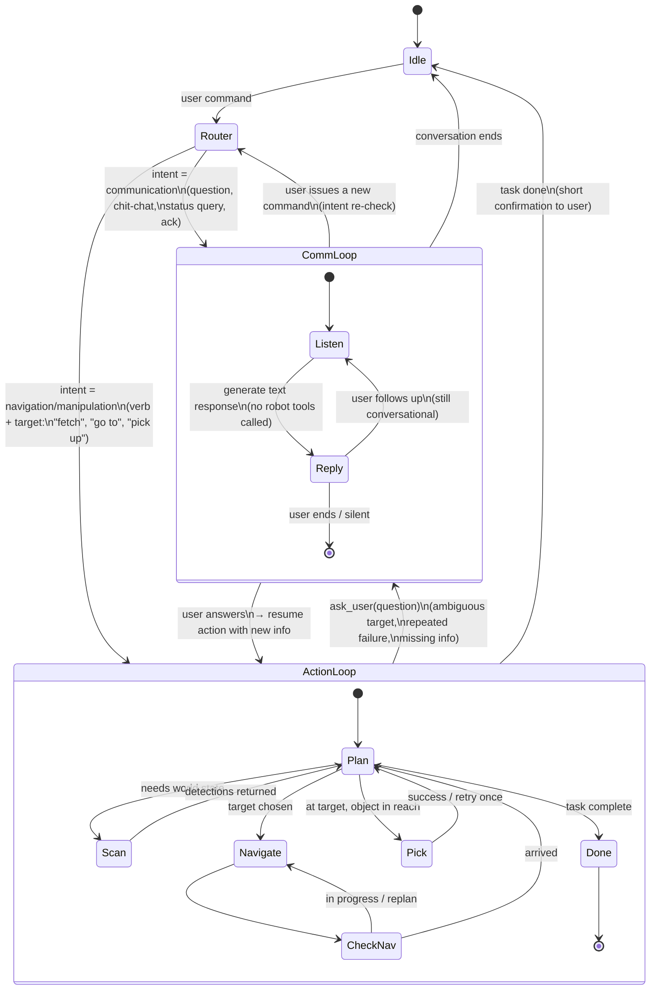

# Agent Flow

Two-mode agent: a **communication loop** for chit-chat / questions / clarifications,
and an **action loop** for physical tasks (scan, navigate, pick up).
The router classifies each user turn and chooses the loop. The action loop can
fall back into communication when it needs the user (clarification, failure
report), and communication can escalate into action when intent shifts.

## State graph

## Router rules (first pass)

The router is a lightweight LLM call (or a cheap classifier) that tags each
incoming user turn as one of:

| Intent          | Examples                                          | Goes to     |
| --------------- | ------------------------------------------------- | ----------- |
| `communication` | "do you have a pen there?", "what can you see?", "hi", "thanks" | CommLoop    |
| `navigation`    | "go to the kitchen", "come here", "back up"       | ActionLoop  |
| `manipulation`  | "fetch the pen", "pick up the eraser", "hand me X"| ActionLoop  |
| `status_query`  | "are you done?", "where are you?"                 | CommLoop (reads state, no motion) |
| `abort`         | "stop", "cancel"                                  | ActionLoop → Done (early exit) |

Heuristics for borderline cases:
- "Do you have / can you see X" → **communication**, answer from last scan
  cache; only re-scan if explicitly asked.
- "Get me X" / "bring X" → **manipulation**.
- A bare noun ("the pen?") inherits intent from the previous turn.

## Loop boundaries (what each mode is *allowed* to do)

**CommLoop** — text only. Allowed tools: `scan_scene` (read-only), `ask_user`.
Forbidden: `navigate_to`, `pick_up`. If the model tries to call a motion tool
here, the router escalates to ActionLoop instead of executing it.

**ActionLoop** — full tool set. Must end with either:
- a success confirmation → return to Idle, or
- an `ask_user` call → hand control to CommLoop, keep action context alive so
  the next user turn can resume mid-task.

## Open questions for cross-check

1. Should the router be a separate LLM call, or fold the decision into the
   action-loop system prompt with a "respond with text only if conversational"
   instruction? (Separate call = cleaner; folded = one fewer round trip.)
2. When CommLoop is paused mid-action (waiting on `ask_user`), how long do we
   keep the action context before timing out back to Idle?
3. Does `status_query` need its own mini-loop, or is it just a one-shot read of
   cached state inside CommLoop?
4. On `abort`, do we cancel in-flight Nav2/MoveIt2 goals, or just stop issuing
   new ones?
